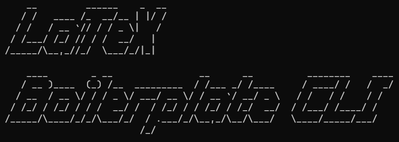
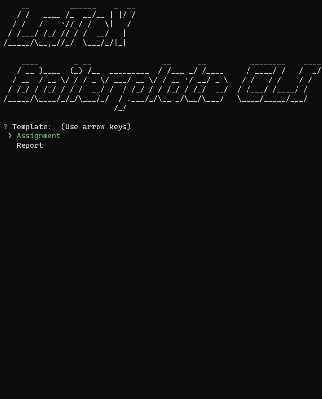

<h1 align="center">
   <br>
   <a href="https://github.com/magnusnor/latex-boilerplate-cli"></a>
   <br>
</h1>

<h4 align="center">A command-line interface for generating LaTeX boilerplate code.</h4>

<p align="center">
    <a href="#technology">Technology</a> •
    <a href="#usage">Usage</a> •
    <a href="#installation">Installation</a> •
    <a href="#development">Development</a>
</p>


## Technology


## Usage



## Installation

### Requirements


- [Python](https://www.python.org/) >= 3.8.10

- [pip](https://pip.pypa.io/en/stable/installation/) >= 20.0.2

### How To
It is recommended to create a virtual environment.

```bash
# Create virtual environment
$ python3 -m venv env

# Activate virtual environment
$ source env/bin/activate

# Install dependencies
$ pip install -r requirements.txt

# Run CLI
$ ./latex-boilerplate-cli

# Deactivate virtual environment
$ deactivate
```

See <a href="#environment-variables">Environment Variables</a>, to set default values for the command-line interface inputs.

## Development

### Environment Variables (Optional)

Create a `.env` file inside the root folder with the environment variables found in the `.env.example` file.

- `CLI_TITLE` - The title of the assignment/report
- `CLI_SUBTITLE` - The subtitle for the assignment/report
- `CLI_AUTHOR` - The author of the assignment/report
- `CLI_DATE` - The date of the assignment/report
- `CLI_PATH` - The path where the workspace will be created
- `CLI_WORKSPACE` - The name of the workspace folder